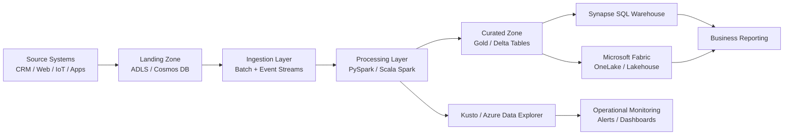
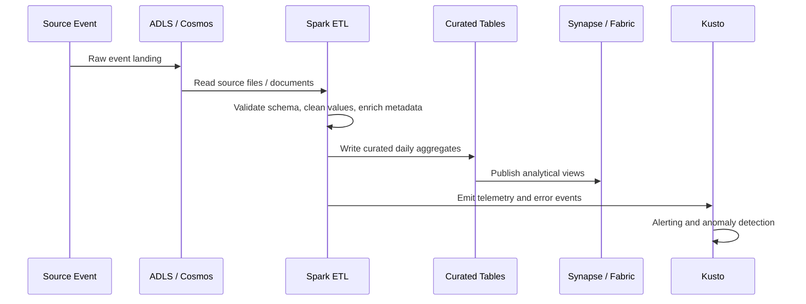
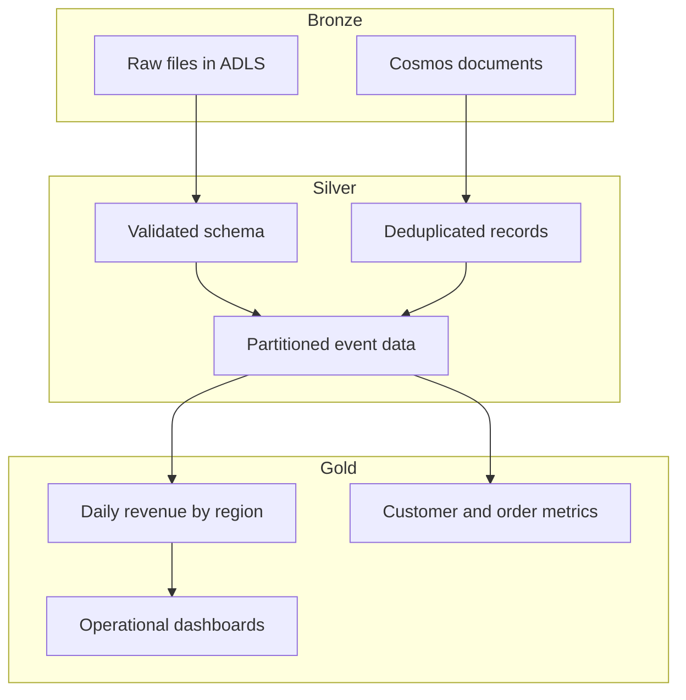

# Architecture and Analysis

## 1. Executive Summary

This repository models a cloud-native data platform for a modern retail and telemetry analytics workload. It follows a lakehouse-oriented design in which raw event data is landed into ADLS, transformed through Spark, curated into analytical tables, and surfaced through Synapse, Fabric, and Kusto for business and operational insight.

The solution is intentionally aligned to the role requirements for a Big Data Engineer working with Microsoft Azure, especially around:

- Synapse Analytics
- Scala and Spark
- PySpark data processing
- SQL and Scope-based logic
- ADLS and Cosmos data access patterns
- Kusto operational analytics
- Microsoft Fabric and OneLake

---

## 2. System Architecture Diagram

---

## 3. Data Flow and Processing View

---

## 4. Analytical Layer Design

---

## 5. Detailed Project Story

This project represents a realistic Azure analytics platform for retail sales and telemetry data. The starting point is raw operational data arriving from multiple systems, such as application events, order transactions, customer activity, and log-based telemetry. These sources are stored in a landing zone using ADLS and, in some cases, Cosmos DB for document-like or transactional records.

From there, Spark jobs perform the critical transformation logic. This includes validating the schema, fixing malformed values, handling missing data, partitioning by date or region, and computing high-value aggregate metrics such as total revenue, order counts, and regional performance. The platform uses both PySpark and Scala examples to demonstrate how large-scale transformations can be implemented across a modern data engineering team.

Once the curated data is ready, it is exposed through warehouse-style SQL views in Synapse and lakehouse-style tables in Microsoft Fabric. This gives downstream analysts and BI consumers a trusted, queryable dataset without making them depend on raw landing-zone files. At the same time, Kusto is used to monitor live operational behavior, including errors, spikes in throughput, and service health indicators.

This architecture is intentionally designed to balance both analytical and operational needs. It demonstrates how a data engineering team can build a reliable pipeline from raw inputs to insight, while also ensuring transparency, observability, and governance.

---

## 6. Role-Aligned Resume Summary

Big Data Engineer with hands-on experience designing and implementing cloud-native data processing solutions on Microsoft Azure. Skilled in building scalable ETL pipelines using Spark, PySpark, and Scala, with practical experience across ADLS, Synapse, Cosmos DB, Kusto, and Microsoft Fabric. Strong familiarity with lakehouse and warehouse patterns, partitioning strategies, and operational monitoring for high-volume analytical workloads.

Core capabilities:

- Designed data pipelines for ingestion, transformation, and curated analytics data delivery
- Implemented Spark-based processing for ETL, aggregation, and partition-aware business metrics
- Worked with ADLS and Cosmos storage patterns for raw and semi-structured data
- Built SQL-based analytical models and curated views for Synapse and Fabric use cases
- Supported operational insights using Kusto queries, anomaly checks, and alerting patterns
- Collaborated across ingestion, analytics, and reporting layers to deliver business-ready data products

---

## 7. Why This Repo Matters

This repository is valuable because it addresses the full cloud data lifecycle rather than only a single component. It shows how raw events become cleansed, trustworthy, and usable data products, and how that data is surfaced to both reporting and operational monitoring systems.

From a hiring perspective, this demonstrates a strong understanding of modern Azure data engineering foundations, including:

- data lake architecture
- distributed processing
- data quality and validation
- warehouse and lakehouse design
- monitoring and observability
- business-focused data product thinking

---

## 8. End-to-End Sample Pipeline

The sample pipeline in this repository demonstrates a realistic daily revenue processing workflow:

1. Read raw telemetry data from a local CSV source.
2. Validate required fields such as customer, order, event timestamp, amount, and region.
3. Transform and enrich the records with date-partition columns.
4. Aggregate revenue by date and region.
5. Write curated outputs to a gold-layer destination.
6. Expose the results for dashboarding and reporting.

This is representative of the same pattern used in enterprise Azure data engineering teams, where bronze, silver, and gold layers prepare data for analytics and operational decisions.

---

## 9. Suggested Next Enhancements

To elevate the project further, the next steps would be:

- add Delta table writes and merge logic
- include structured event-stream simulation using Kafka or Event Hubs
- add a Synapse SQL deployment script and schema migration workflow
- model a Fabric OneLake notebook workflow with curated table publishing
- implement a Kusto alert rule using a realistic threshold-based business scenario
